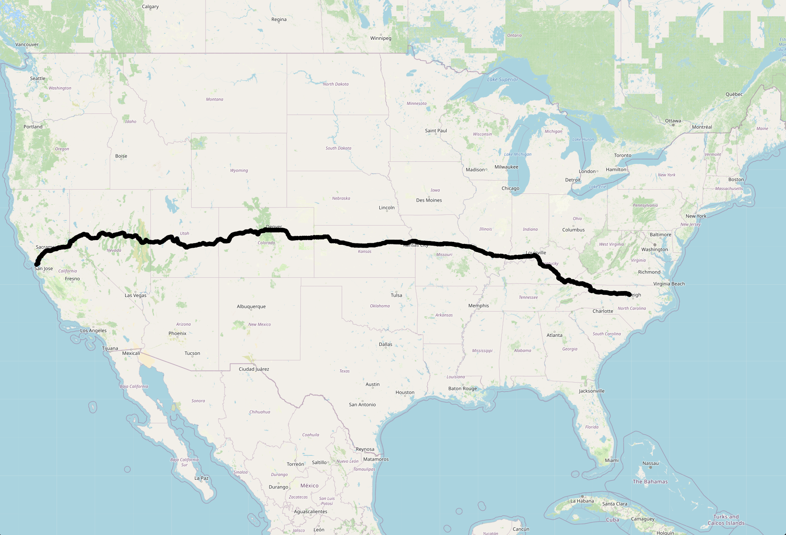

<!-- Improved compatibility of back to top link: See: https://github.com/othneildrew/Best-README-Template/pull/73 -->
<a name="readme-top"></a>
<!--
*** Thanks for checking out the Best-README-Template. If you have a suggestion
*** that would make this better, please fork the repo and create a pull request
*** or simply open an issue with the tag "enhancement".
*** Don't forget to give the project a star!
*** Thanks again! Now go create something AMAZING! :D
-->


<!-- PROJECT SHIELDS -->
<!--
*** I'm using markdown "reference style" links for readability.
*** Reference links are enclosed in brackets [ ] instead of parentheses ( ).
*** See the bottom of this document for the declaration of the reference variables
*** for contributors-url, forks-url, etc. This is an optional, concise syntax you may use.
*** https://www.markdownguide.org/basic-syntax/#reference-style-links
-->
[![Contributors][contributors-shield]][contributors-url]
[![Forks][forks-shield]][forks-url]
[![Stargazers][stars-shield]][stars-url]
[![Issues][issues-shield]][issues-url]
[![MIT License][license-shield]][license-url]
[![LinkedIn][linkedin-shield]][linkedin-url]


<!-- PROJECT LOGO -->
<br />
<div align="center">
  <a href="https://github.com/wanghley/routing-system">
    
  </a>

  <h3 align="center">Routing service</h3>

  <p align="center">
    A project to demonstrate the use of graphs and simulate how maps services works.
    <br />
    <a href="https://github.com/wanghley/routing-service"><strong>Explore the docs »</strong></a>
    <br />
    <br />
    <a href="https://github.com/wanghley/routing-service">View Demo</a>
    ·
    <a href="https://github.com/wanghley/routing-service/issues">Report Bug</a>
    ·
    <a href="https://github.com/wanghley/routing-service/issues">Request Feature</a>
  </p>
</div>


<!-- TABLE OF CONTENTS -->
<details>
  <summary>Table of Contents</summary>
  <ol>
    <li>
      <a href="#about-the-project">About The Project</a>
    </li>
    <li>
      <a href="#getting-started">Getting Started</a>
      <ul>
        <li><a href="#prerequisites">Prerequisites</a></li>
        <li><a href="#executing">Executing</a></li>
        <li><a href="#usage">Usage</a></li>
      </ul>
    </li>
    <li><a href="#contributing">Contributing</a></li>
    <li><a href="#license">License</a></li>
    <li><a href="#contact">Contact</a></li>
    <li><a href="#acknowledgments">Acknowledgments</a></li>
  </ol>
</details>


<!-- ABOUT THE PROJECT -->
## About The Project

[![Product Name Screen Shot][product-screenshot]](https://github.com/Wanghley/routing-service)

Understanding how people use and interact with space is essential when building a system to calculate routes and distances in a plane (or geoide in the case of Earth). Such sensations are typically subjective, making it challenging to accurately recreate them in a computer. However, by focusing on a smaller portion of the issue, we may develop approaches for gauging particular elements of a routing system. We may use a field of mathematics called graph theory, which is based on a data structure called a graph, to calculate these sorts of metrics.

If we visualize our geographical data as a graph, we may use a variety of existing algorithms designed to address certain queries about such structures. The shortest path may be quickly determined using Dijkstra's Algorithm, for instance, if we want to know the distance between two locations in a space. All potential pathways can be represented as a graph of nodes and edges.

In summary, this is a implementation of a routing service that plots the US highway network as a graph and determines routes and distances on it. Stores a graph representation at a high level and offers open methods to respond to connection, separation, and pathfinding methods. A MVP is also included to show how the algorithm works and make it simple to see the outcomes.


<p align="right">(<a href="#readme-top">back to top</a>)</p>


## Getting Started

This project was developed to provide you with an example of application of graph algorithms and it can be executed locally in your computer.

### Prerequisites

* Linux
  ```sh
  sudo apt update -Y
  java -version
  ```
  ```sh
  sudo apt install default-jdk
  ```
* MacOs
  ```sh
  brew upgrade -Y
  brew install java
  java --version
  ```


### Executing

_Below are the instructions on installing and setting up the app. This project does use some external libraries as in the lib folder for automate testing (JUnit) but it is not necessary for executing the application._

1. Open the terminal on the desired location you want to save the project in your computer
2. Clone the repo
   ```sh
   git clone https://github.com/wanghley/routing-service.git
   ```
3. Install prerequisites as instructed above

4. with your terminal, go to the root folder of the project
5. Run the demo
 ```sh
   cd src/
   javac -d .. GraphDemo.java
   cd ..
   java GraphDemo
   ```
6. Add the information as required on the terminal

<p align="right">(<a href="#readme-top">back to top</a>)</p>


## Usage

This project can be used to show applications of graph algorithms and, specifically, how to use Dijkstra;s algorithm in the real world scenario.

The current demo uses the terminal to insert the information from the start point and destination with a path being draw in a GUI automatically opened. For example, a path from Durham NC to San Francisco CA can be represented by the screenshot below.
<div align="center">
<a href="https://github.com/wanghley/routing-system">
    
  </a>
</div>

This application can also be used to simulate any other scenario in which a shortest path is needed. For communication purposes, traveling, and any other scenario. A full explanation demo can be found on the video below recorded by the authors of this project.

<iframe width="560" height="315" src="https://www.youtube.com/embed/ELbJdmaFDi4" title="YouTube video player" frameborder="0" allowfullscreen></iframe>

<p align="right">(<a href="#readme-top">back to top</a>)</p>


## Contributing

Contributions are what make the open source community such an amazing place to learn, inspire, and create. Any contributions you make are **greatly appreciated**.

If you have a suggestion that would make this better, please fork the repo and create a pull request. You can also simply open an issue with the tag "enhancement".
Don't forget to give the project a star! Thanks again!

1. Fork the Project
2. Create your Feature Branch (`git checkout -b feature/AmazingFeature`)
3. Commit your Changes (`git commit -m 'Add some AmazingFeature'`)
4. Push to the Branch (`git push origin feature/AmazingFeature`)
5. Open a Pull Request

<p align="right">(<a href="#readme-top">back to top</a>)</p>


<!-- LICENSE -->
## License

Distributed under the MIT License. See `LICENSE.md` for more information.

<p align="right">(<a href="#readme-top">back to top</a>)</p>


<!-- CONTACT -->
## Contact

Wanghley Soares Martins - [@wanghley](https://instagram.com/wanghley) - wanghley.soares.martins@duke.edu<br>
Aseda Asomani - [@_bennoni_](https://instagram.com/_bennoni_) - benjamin.asomani@duke.edu

Project Link: [https://github.com/wanghley/routing-service](https://github.com/wanghley/routing-service)

<p align="right">(<a href="#readme-top">back to top</a>)</p>


<!-- ACKNOWLEDGMENTS -->
## Acknowledgments

This project was part of the Algorithms and Data Structure class at Duke University and you may stay warned that you must comply to Duke Community Standards and any use of this code is under your responsibility and ethic. I am not responsible, as well as any other authors, for any misuse of this example provided here on this repository.

This project is free to be used, implemented, changed, shared, and modified since its result remains public and accessible. However, it should be used ethically and respecting all standards. Please, do not plagiarize this project on your own benefit.

<p align="right">(<a href="#readme-top">back to top</a>)</p>


<!-- MARKDOWN LINKS & IMAGES -->
<!-- https://www.markdownguide.org/basic-syntax/#reference-style-links -->
[contributors-shield]: https://img.shields.io/github/contributors/wanghley/routing-service.svg?style=for-the-badge
[contributors-url]: https://github.com/wanghley/routing-service/graphs/contributors
[forks-shield]: https://img.shields.io/github/forks/wanghley/routing-service.svg?style=for-the-badge
[forks-url]: https://github.com/wanghley/routing-service/network/members
[stars-shield]: https://img.shields.io/github/stars/wanghley/routing-service.svg?style=for-the-badge
[stars-url]: https://github.com/wanghley/routing-service/stargazers
[issues-shield]: https://img.shields.io/github/issues/wanghley/routing-service.svg?style=for-the-badge
[issues-url]: https://github.com/wanghley/routing-service/issues
[license-shield]: https://img.shields.io/github/license/wanghley/routing-service.svg?style=for-the-badge
[license-url]: https://github.com/wanghley/routing-service/blob/master/LICENSE.md
[linkedin-shield]: https://img.shields.io/badge/-LinkedIn-black.svg?style=for-the-badge&logo=linkedin&colorB=555
[linkedin-url]: https://linkedin.com/in/wanghley
[product-screenshot]: images/screenshot.png
[Next.js]: https://img.shields.io/badge/next.js-000000?style=for-the-badge&logo=nextdotjs&logoColor=white
[Next-url]: https://nextjs.org/
[React.js]: https://img.shields.io/badge/React-20232A?style=for-the-badge&logo=react&logoColor=61DAFB
[React-url]: https://reactjs.org/
[Vue.js]: https://img.shields.io/badge/Vue.js-35495E?style=for-the-badge&logo=vuedotjs&logoColor=4FC08D
[Vue-url]: https://vuejs.org/
[Angular.io]: https://img.shields.io/badge/Angular-DD0031?style=for-the-badge&logo=angular&logoColor=white
[Angular-url]: https://angular.io/
[Svelte.dev]: https://img.shields.io/badge/Svelte-4A4A55?style=for-the-badge&logo=svelte&logoColor=FF3E00
[Svelte-url]: https://svelte.dev/
[Laravel.com]: https://img.shields.io/badge/Laravel-FF2D20?style=for-the-badge&logo=laravel&logoColor=white
[Laravel-url]: https://laravel.com
[Bootstrap.com]: https://img.shields.io/badge/Bootstrap-563D7C?style=for-the-badge&logo=bootstrap&logoColor=white
[Bootstrap-url]: https://getbootstrap.com
[JQuery.com]: https://img.shields.io/badge/jQuery-0769AD?style=for-the-badge&logo=jquery&logoColor=white
[JQuery-url]: https://jquery.com 